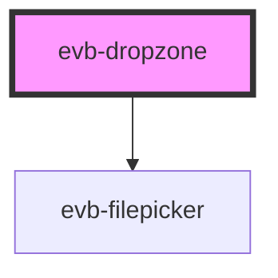

# evb-dropzone

<!-- Auto Generated Below -->

## Properties

| Property | Attribute | Description                                                                                                                                                                                                                                                                                | Type     | Default     |
| -------- | --------- | ------------------------------------------------------------------------------------------------------------------------------------------------------------------------------------------------------------------------------------------------------------------------------------------ | -------- | ----------- |
| `accept` | `accept`  | A string that defines the file types the file input should accept. This string is a comma-separated list of unique file type specifiers. To accept images, video and audio, use: accept="audio/*,video/*,image/*" otherwise provide the correct mimetype, eg: image/png for png images etc | `string` | `undefined` |

## Events

| Event     | Description                         | Type                      |
| --------- | ----------------------------------- | ------------------------- |
| `dropped` | Fired after a file has been picked§ | `CustomEvent<PickedFile>` |

## Dependencies

### Depends on

- [evb-filepicker](../file-picker)

### Graph

----------------------------------------------

*Built with [StencilJS](https://stenciljs.com/)*
