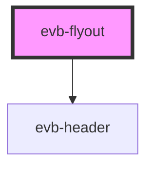

# evb-flyout

<!-- Auto Generated Below -->

## Properties

| Property | Attribute | Description | Type      | Default     |
| -------- | --------- | ----------- | --------- | ----------- |
| `header` | `header`  |             | `string`  | `undefined` |
| `open`   | `open`    |             | `boolean` | `undefined` |

## Events

| Event   | Description | Type                |
| ------- | ----------- | ------------------- |
| `close` |             | `CustomEvent<void>` |
| `open`  |             | `CustomEvent<void>` |

## Methods

### `toggle(forceOpen?: boolean) => Promise<void>`

#### Returns

Type: `Promise<void>`

## Dependencies

### Depends on

- [evb-header](../header)

### Graph

----------------------------------------------

*Built with [StencilJS](https://stenciljs.com/)*
