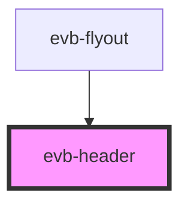

# evb-button-bar

<!-- Auto Generated Below -->

## Properties

| Property               | Attribute | Description | Type               | Default     |
| ---------------------- | --------- | ----------- | ------------------ | ----------- |
| `heading` _(required)_ | `heading` |             | `number \| string` | `undefined` |

## Dependencies

### Used by

 - [evb-flyout](../flyout)

### Graph

----------------------------------------------

*Built with [StencilJS](https://stenciljs.com/)*
